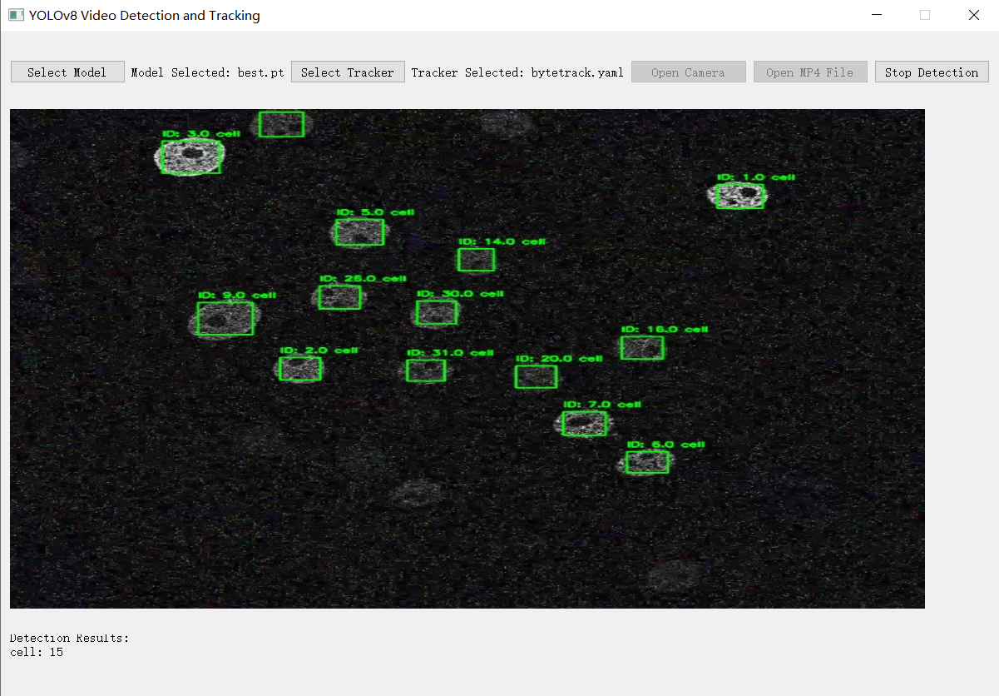

# BIA ICA Group 7 Documents

> **Cell_tracker: A multi-cell detection tracking software**
> 
> Zixin Wen, Yu Bai, Yao Sun, Ziyi Xu, Hanzhang Li, Yubing Jin, Zhe Cui
> 

## Result Demo

### Yolo Result


<video width="600" controls>
  <source src="./doc/yolo_demo.mp4" type="video/mp4">
</video>


### Tracing Result


<video width="600" controls>  <source src="./doc/tracing_demo.mp4" type="video/mp4"></video>

### Extremely Test

<video width="600" controls>  <source src="./doc/extremely_test.mp4" type="video/mp4"></video>

## Abstract

YOLOv8 is a target detection algorithm based on Convolutional Neural Networks (CNNs). Its main innovation
is transforming the task into a regression problem, directly predicting both the target class and bounding box from
imagepixels. Afterextractingimagefeatures,YOLOv8usesanimprovedmulti-scalepredictionmethodandadaptive
anchor boxes for precise target detection. With an efficient loss function and post-processing algorithms, YOLOv8
maintains high detection speed while achieving high accuracy,making it widely applied in real-time detection tasks.

ByteTrack is a multi-object tracking (MOT) algorithm designed to improve performance by associating each detection box. Traditional MOT methods typically associate only high-confidence detection boxes, which can lead to
occlusion or missed detections due to low-confidence targets, resulting in fragmented trajectories. ByteTrack alle
viates this issue by associating all detection boxes, including low-confidence ones, using a simple yet effective data
association strategy.

The main advantages of ByteTrack lie in its simplicity and versatility. It does not rely on complex appearance feature
extraction or re-identification (ReID) models but instead uses the similarity between detection boxes and trajectories
(such as position overlap) for association. 

Cellpose uses deep CNNs for image segmentation,training on large-scale cell image datasets to learn how to segment cells. It handles various cell types and morphologies, including irregular shapes and overlapping cells, by fine-tuning pre-trained models.

Our software integrates YOLO’s detection boxes with Cellpose's appearance features, using the ByteTrack algorithm
for tracking. This combination enables real-time cell tracking

## Installtation
### 1. Installing on the host machine
Step1. Install Cell_tracker
```shell
git clone git@github.com:Lhz002/BIA_ICA.git
cd BIA_ICA
conda env create -f environment.yml
```

Step2. Install [pycocotools](https://github.com/cocodataset/cocoapi).

```shell
pip3 install cython; pip3 install 'git+https://github.com/cocodataset/cocoapi.git#subdirectory=PythonAPI'
```

Step3. Others
```shell
pip3 install cython_bbox
```
## File Structure

The downloaded file should be in the following structure:
```
.
|-- README.md
|-- cell_data
|   |-- cellpose_result
|   |-- images
|   |-- labels
|   `-- video
|-- doc
|   |-- extremely_test.mp4
|   |-- tracing_demo.mp4
|   `-- yolo_demo.mp4
`-- yolov8-42
    |-- 1_demo
    |-- cellpose
    |-- runs
    |-- tests
    |-- ultralytics
    `-- ultralytics.egg-info
```

The main functions of the software are in the ./yolov8-42/1-demo file

```shell
./yolov8-42/
|-- 1_demo
|   |-- __pycache__
|   |-- images
|   |-- record
|   |-- runs
|   |-- start_single_detect.py
|   |-- start_tracing.py
|   |-- start_train.py
|   |-- start_val.py
|   |-- start_webcam.py
|   |-- start_window.py
|   |-- yolov8n.pt
|   `-- yolov8s.pt
|-- cellpose
|   |-- cellpose_model.ipynb
|   `-- my_retrained_model2
|-- runs
|   `-- detect
```


## How to Use

### Cell Tracker Part

Our main functions are in **"start_tracing.py"** and **"start_window.py"**. After running **"start_window.py"**, a graphical user interface (GUI) will appear.


You can change the pretrained models in file path: BIA_ICA\yolov8-42\runs\detect\\You can change the pretrained models by modifying the file path: **BIA_ICA\yolov8-42\runs\detect\{train_round_number}**. This folder contains two model weight files: **best.pt** (best performance) and **last.pt** (last performance). On the video detection page, upload your test video from the path **BIA_ICA\cell_data\video\test**.{train_round_number}. In this file, it has two model weight file, best.pt and last.pt, means the best performance and the last performance. In the video detection page, you can up load the test video in path BIA_ICA\cell_data\video\test.


To use the tracing feature, run **"start_tracing.py"** to access the following interface. You can choose the model from the path mentioned earlier. Different tracing algorithm configurations are available in **BIA_ICA\yolov8-42\ultralytics\cfg\trackers**. After selecting the files, you will see the tracing results.




### Cell Pose Part

Environment Configuration

```
conda create --name cellpose python=3.10
python -m pip install cellpose[gui]
```

**Dependencies：**

Pytorch, pyqtgraph, PyQt5, numpy (>=1.16.0), numba, scipy, natsort

Folder Structure

**Training data:** Images and corresponding mask files stored in the same folder.

**Testing data:** Similar structure as training data.

```
Example:

cell_pose_data/

  train_data/

​    image1.png/jpg

​    image1_masks.tif

  test_data/

​    test_image1.png/jpg

test_image1_masks.tif
```

#### Data Loading

Training and test data are loaded using cellpose.io.load_train_test_data. 

#### Model Training

Our cellpose model is initialized with cyto3 as the base model. You can change to cyto or cyto2.

**Key parameters:**

n_epochs: Number of training epochs.

patience: Early stopping patience.

min_delta: Minimum improvement in loss to reset patience.

#### Visualization and Output Result

**Outputs:**

PNG images for segmentation overlays.

.tif mask files.

.txt files for segmentation contours.

 

#### Evaluation (IoU Calculation)

**Output:**

IoU for current image

Mean IoU for all test images

## Acknowledge

A large part of the code is borrowed from [YOLO](https://github.com/Megvii-BaseDetection/YOLOX), [Byte track](https://github.com/ifzhang/FairMOT) and[Cellpose](https://github.com/PeizeSun/TransTrack). Many thanks for their wonderful works.